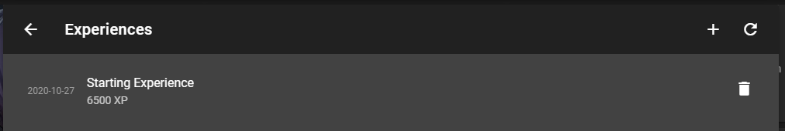

# The Character Tab

The Character tab, or rather the Build view inside it, is the first thing you'll see when creating a new character. It's here that you can review your character's non-mechanical details, as well as use the Slot system to make decisions about your character's build.

### Character Details

The first card is your character details; this can display an image of your character, as well as their name, alignment, and gender. This info will also show at the top of their sheet, and on their entry in the character list in the sidebar. Clicking on it will show an edit view where you can modify all of this information.

### Build

The next card is the Build view, where you can work with the Slot system as discussed in [Character Creation 101](character-creation-101.md). Empty or important slots will show in the summary card view, and you can click the card heading to see a more detailed view, including filled slots that have been automatically hidden for organization purposes.

### Levels

The next card shows your level, current experience, and class spread. Classes will be automatically displayed based on your choices in the Build view, and can't be edited directly here. Clicking the \(i\) button will take you to a list where you can record your experience and the events that it was earned from, and the + button will take you directly to the edit view for a new entry.

### Notes

The other cards shown in the example screenshot are Notes. They can be added and removed from the Tree tab or Build view, and provide a simple way to keep text notes about your character's roleplay info, history, background, and more.

