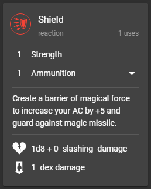

# The Stats Tab

The tab you'll probably spend the most time on is the Stats tab. This is where your core stats like ability scores, proficiencies, spell slots, and so on live. It's also where you can see and use your available actions, manage your hit points, and perform rests. Feel free to play around with all the little levers and knobs on the Stats tab to get familiar with how they work!

### Actions

Actions are Dicecloud's primary automation tool, and once your character is set up, you'll likely find a number of them hanging out on your Stats tab. They look something like this:

Clicking the circular button at the top left of the action card will perform the action; a use \(top left\) will be consumed, along with the number shown of each attribute or ammunition item above the description. Additionally, rolls will be performed and attributes modified as shown below the description.

### Attacks

Attacks are a special type of action, which have additional automatic rolls baked in. You can distinguish them by looking at the circular button; an icon represents an action, and a modifier number represents an attack.

### Buffs

Actions can also sometimes apply buffs, which are persistent modifiers to your character representing a status condition or temporary ability. While these don't show on the action card itself, they will appear in a list on the left-hand side of the Stats tab when applied, and can be removed with the trash can icon.

### 

